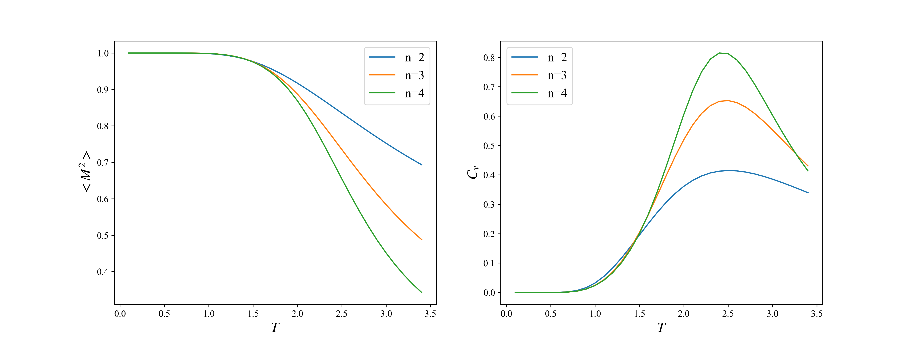

- Name：Guanju Yan 
- Student ID：521432910010

## 3.24
- Check CP2024_code/IsingLattice/
- Results are in 1-ResultCheck.ipynb
- Unit test result:

============================= test session starts =============================

platform win32 -- Python 3.11.5, pytest-8.1.1, pluggy-1.4.0
rootdir: d:\BaiduSyncdisk\大二下物理系\2计算物理\CP2024_code\IsingLattice
plugins: anyio-4.0.0
collected 8 items

Pytest_week3_true.py ........                                            [100%]

============================== 8 passed in 0.45s ==============================

- $C_v$ and $\langle M^2\rangle $ results for $n=2,3,4$:

## 3.11
- check CP2024_code/python/Pytest_For_IsingSystem folder
- unit test is executed and its results are in Pytest.ipynb
- Unit test code is in Pytest.py
- Pytest.py, IsingSystemClass.py is needed

## 3.7
- check CP2024_code/python/IsingSystem/1-ResultCheck-week3.ipynb
- IsingSystemClass.py is needed

## 3.1
- Homework is in Python/Week2 Folder!

